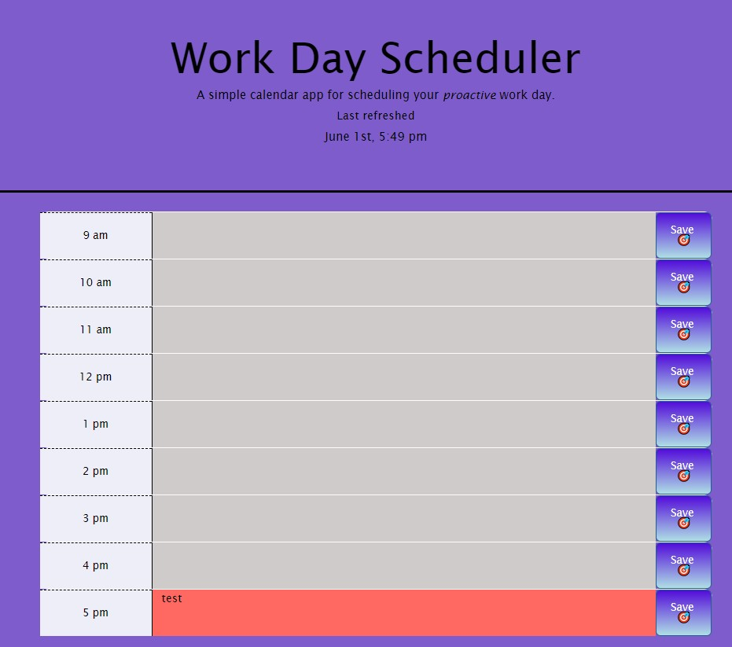

# Work Day Scheduler

## Live Application Link

[Work Day Scheduler](https://andersonjaz.github.io/workday-scheduler/)

## Description
An application to set time-block for improving productivity. This app will allow you to easily plan your day and save/delete tasks.

## Instruction
- The current date is displayed at the top of the calendar.
- The standard business hours of operation are listed from 9 am to 5 pm.
- Time blocks are color coded for past, present and future.
- Click into a time block to enter an event.
- Click the save button to save that time block in local storage.
- The saved events persist after refresh the page.

## Built With
- [x] HTML
- [x] CSS
- [x] JavaScript
- [x] jQuery
- [x] Moment.js

## Images

## References

[Bootstrap documentation](https://getbootstrap.com/docs/4.3/layout/grid/)

[Devhints.io for Moment.js](https://devhints.io/moment)

[jQuery Documentation](https://learn.jquery.com/using-jquery-core/document-ready/)

[MomentJS Documentation](https://momentjs.com/)    
